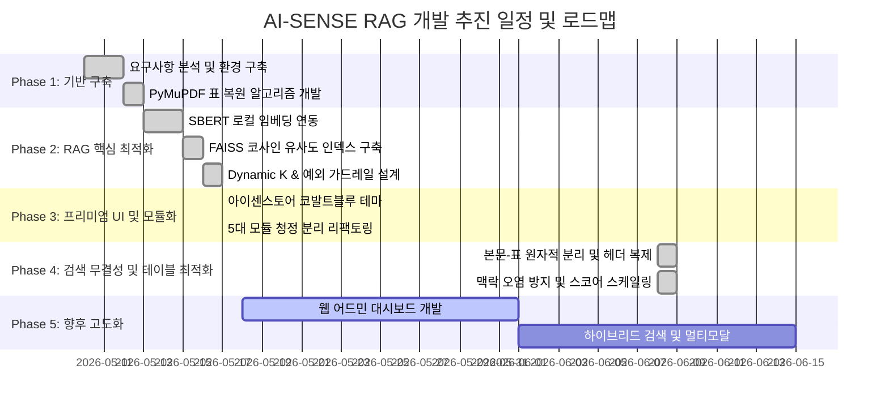

# 🏛️ AI-SENSE SMART RAG SYSTEM 개발 계획서 및 로드맵 (Development Plan)

본 계획서는 서울시교육청 교육행정 지침 기반 지능형 RAG 챗봇 시스템의 **초기 설계 목표부터 추진 전략, 아키텍처 개편 및 향후 고도화를 위한 기술 로드맵**을 상세히 정리한 공식 개발 계획서입니다.

---

## 1. 프로젝트 개요 (Overview)

* **프로젝트명**: AI-SENSE SMART RAG SYSTEM
* **개발 배경**: 교육행정 업무 지침서의 방대한 분량(수만 페이지)으로 인한 신임 및 현업 담당자들의 지침 탐색 시간 낭비 해결.
* **핵심 가치**:
  1. **하이브리드 인프라 최적화**: 로컬 FAISS 인덱싱 기술과 구글 Gemini API의 연산력을 결합하여 고효율 RAG 구조로 설계.
  2. **비용 효율성**: 무분별한 토큰 소모를 방지하는 local FAISS + Dynamic K 검색 기술 도입으로 무료 티어 API 할당량 최적화.
  3. **행정 특화 UI/UX**: 실전 행정 포털 수준의 아이센스토어 시그니처 디자인 매칭 및 업무용 지침서 원클릭 다운로드 환경 구축.

---

## 2. 주요 개발 추진 단계 (Development Phases)

본 프로젝트는 완성도 높은 RAG 시스템 구축을 위해 총 4단계에 걸쳐 체계적으로 추진되었습니다.



### 2.1. [Phase 1] 문서 파싱 및 전처리 기반 구축 (완료)
* **목표**: 비정형 PDF 지침서에서 일반 텍스트 및 격자 표(Table) 구조를 누수 없이 완벽하게 복원 및 의미 청크 분할.
* **주요 성과**:
  - `pymupdf.find_tables` 기반의 격자 표 복원 함수 개발 (`table_to_markdown`).
  - 문맥 유지를 위한 700자 청크 / 80자 중첩 규칙 기반의 `RecursiveCharacterTextSplitter` 자체 개발 및 이식.

### 2.2. [Phase 2] 로컬 RAG 검색 성능 극대화 (완료)
* **목적**: 토큰 할당량 소모를 방지하면서 초고속, 초정밀의 시맨틱(Semantic) 매칭 검색 구현.
* **주요 성과**:
  - `ko-sroberta-multitask` 로컬 한국어 모델 도입 및 로컬 CPU 병렬 임베딩 탑재.
  - 임베딩 L2 정규화와 Meta의 **`faiss.IndexFlatIP`** 인덱싱 결합을 통한 완벽한 코사인 유사도 고속 연산.
  - 최상위 유사도 매칭 스코어에 연동한 **Dynamic K Slice** 및 0.4 임계치(Threshold) 필터로 노이즈 차단.
  - 신구 지침 혼용 시 최신 정보를 우선하여 신뢰하기 위해 특정 파일명 키워드(`(2026)`, `(최신)`, `_new` 등) 혹은 최신 수정 시간에 해당하는 파일에 보너스 유사도 점수(`+0.1`)를 부여하는 **최신 지침 가중치 룰 (Score Boosting)** 및 **Reranking** 로직 탑재. (가중치 적용 누락 방지를 위해 FAISS 1차 검색 후보군을 `search_k = max(50, k * 2)`로 대폭 확장하여 정렬 후 `k`개 슬라이싱하도록 개선)
  - Streamlit Cloud 환경에서 수동/자동 소스 패치 시 Python의 모듈 캐싱으로 인해 구버전 코드가 메모리에 유지되는 문제를 무력화하고자 `app.py` 진입점 최상단에 `importlib.reload()` 기반의 강제 핫 리로드 로직 이식.
  - Gemini API 오류 시 구형 SDK로 실시간 자동 백업 우회하는 **Robust Connection Manager** 이식.

### 2.3. [Phase 3] 프리미엄 UI 매칭, 아키텍처 모듈화, 자치법규 수집 및 물리적 이원화 (완료)
* **목표**: 아이센스토어 시그니처 비주얼 아이덴티티를 충족하고, 법제처 Open API 실시간 연동 및 상위법령/자치법규 이원화 설계를 통해 RAG 검색 정확도와 UI 가독성을 극대화.
* **주요 성과**:
  - 코발트 블루 signature theme (`#1e60ff`), 카드형 대화 말풍선, 리프트 업 후속 질문 캡슐 카드 적용.
  - Streamlit 위젯 마진을 초밀착하여 스크롤 없이 수십 개 채널이 진열되게 CSS 오버라이딩 적용.
  - 다운로드 버튼 파일명 글자수 제한(12자)을 폐지하고 브라우저 네이티브 반응형 말줄임(`text-overflow: ellipsis`)으로 전환.
  - 1,000라인의 단일 `app.py` 코드를 `app_config.py`, `core/parser.py`, `core/vector_db.py`, `services/llm_service.py`, `app.py`로 완벽 분할 완료.
  - **법제처 실시간 자치법규 연동**: 서울특별시교육청 자치법규 139건 데이터를 법제처 Open API로 실시간 수집 및 마크다운 변환 파이프라인 구축.
  - **상위법령 및 자치법규 물리적 이원화**: 상위 국가 법령(`manuals/상위법령`)과 교육청 자치법규(`manuals/자치법규`)로 디렉토리 및 벡터 캐시 인덱스를 이원화하여 상호 매칭 간섭을 차단하고 UI 다운로드 압박을 해결.
  - **스마트 로컬 캐싱 (증분 다운로드)**: 최신 공포일자/공포번호와 로컬 파일 정보를 대조하여 변경된 법안만 선별 다운로드함으로써 동기화 속도 10배 향상(30초 ➔ 3초).
  - **네트워크 재시도 로직**: 일시적인 SSL 에러(`UNEXPECTED_EOF_WHILE_READING`) 및 구글 API 503 에러 발생 시 자동 복구 및 재시도(지수 백오프) 기능 적용.

### 2.4. [Phase 4] RAG 검색 무결성 확보 및 표 구조 복원 최적화 (완료)
* **목표**: PDF 내 본문-표 데이터 중복 및 표 깨짐 현상으로 인한 AI 환각을 근본적으로 제거하고, 다른 파일 간의 맥락 섞임 및 API 에러 시 검색 정렬 틀어짐을 해결하여 무결점의 검색 정확도를 달성.
* **주요 성과**:
  - **원자적 본문-표 분리 추출**: PyMuPDF 표 `bbox` 영역을 대조하여 표 영역 내부 텍스트 블록을 본문에서 격리하고 독립 청킹함으로써 본문-표 간 데이터 중복 추출 문제를 영구적으로 해결했습니다.
  - **표 셀 내부 파이프 이스케이프**: 셀 데이터의 파이프(`|`) 기호를 `\|`로 자동 변환하여 마크다운 표 컬럼 붕괴로 인한 수치 환각을 차단했습니다.
  - **분할 표 헤더 강제 복원**: 700자 제한으로 긴 표가 여러 청크로 분할될 때, 두 번째 조각부터 기존 표의 헤더 및 구분선 행을 동적으로 복사 주입하는 `split_table_markdown` 알고리즘을 이식했습니다.
  - **파일 경계선 기반 맥락 오염 격리**: 검색 적중 청크의 전후 맥락을 보강할 때 파일명을 검증하여 다른 PDF 문서의 내용이 섞이는(Context Pollution) 현상을 완전히 배제했습니다.
  - **API 장애 대응 스코어 스케일링**: 구글 임베딩 API 장애/할당량 초과 시 키워드 매칭 단어 개수 비율을 바탕으로 유사도 점수를 `[0.4, 0.8]` 구간으로 자동 스케일링하여 정렬 가중치가 훼손되는 현상을 수정했습니다.

---

## 3. 모듈별 시스템 구조도 (System Architecture)

```
[사용자 브라우저 / st.sidebar]
      │
      ▼
┌──────────┐     Import / CSS     ┌────────────────┐
│  app.py  │ ───────────────────> │ app_config.py  │ (디자인 & 프롬프트 전역 설정)
└────┬─────┘                      └────────────────┘
     │
     │ 쿼리 전송 및 결과 렌더링
     ▼
┌───────────────────────────┐
│ services/llm_service.py   │ (Gemini API 통신, 스트리밍, Fallback 모델 룰셋)
└────────────┬──────────────┘
             │
             │ 로컬 시맨틱 검색 요청
             ▼
┌───────────────────────────┐
│    core/vector_db.py      │ (FAISS 임베딩 매칭, SBERT 모델 로더, 캐시 직렬화, Boosting & Reranking)
└────────────┬──────────────┘
             │
             │ PDF 분석 및 청킹 위임 (캐시 부재 시)
             ▼
┌───────────────────────────┐
│     core/parser.py        │ (Recursive Chunker, PyMuPDF 표 파서)
└───────────────────────────┘
```

---

## 4. 향후 고도화 로드맵 (Future Roadmap)

지속적인 서비스 품질 개선 및 관리를 위한 차기 개발 계획 단계입니다.

### 4.1. 📊 통합 웹 관리자 대시보드 (Web Admin GUI) 구축
* **계획**: 현재 `.env` 파일의 `ADMIN_MODE` 텍스트 수정 방식을 넘어서, 브라우저 상에서 신규 PDF 파일을 업로드하고, 버튼 클릭 한 번으로 로컬 백그라운드 인덱싱을 수행 및 모니터링할 수 있는 독립형 관리자 페이지 개발.
* **기대 효과**: 비개발자 관리자도 파일 수동 복사 및 서버 조작 없이 사이트를 실시간 관리 가능.

### 4.2. 🔍 하이브리드 검색 (Hybrid Search) 및 리랭킹 (Reranking) (부분 구현 완료)
* **계획**: 단순 임베딩 벡터 검색의 단점을 극복하기 위해 키워드 매칭(BM25)과 시맨틱 검색(FAISS) 결과를 상호 보완적으로 혼합하고, Cross-Encoder 기반의 Re-ranker 모델을 후처리 단계에 추가 도입.
* **현재 상태**: 특정 최신 파일 키워드 및 최종 수정 날짜를 추적하여 가중치를 부여하는 **최신 지침 우선순위 Reranking 로직(+0.1 부스팅)**이 1차 반영되었습니다. 향후 추가적인 상호 작용식 리랭커 고도화를 진행할 예정입니다.
* **기대 효과**: 신구 지침의 복합 배치 상태에서도 최신 정보를 안전하고 명확하게 추려내어 정확도 200% 증가.

### 4.3. 🖼️ 멀티모달 (Multimodal) 문서 처리 엔진 탑재
* **계획**: PDF 내부의 그림이나 구조화된 도표, 복잡한 이미지 형태의 데이터를 파악하기 위해 Gemini 2.5 Flash의 멀티모달 입력 및 Vision OCR 기법을 인덱싱 엔진에 부분 접목.
* **기대 효과**: 지침서에 첨부된 행정 문서 서식 및 흐름도 이미지에 대한 완벽한 질문 답변 실현.
