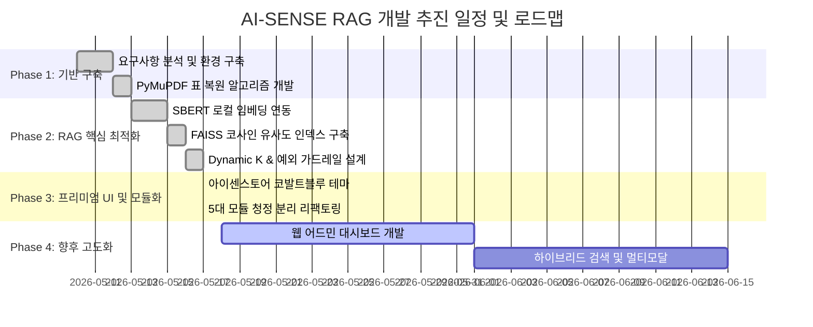

# 🏛️ AI-SENSE SMART RAG SYSTEM 개발 계획서 및 로드맵 (Development Plan)

본 계획서는 서울시교육청 교육행정 지침 기반 지능형 RAG 챗봇 시스템의 **초기 설계 목표부터 추진 전략, 아키텍처 개편 및 향후 고도화를 위한 기술 로드맵**을 상세히 정리한 공식 개발 계획서입니다.

---

## 1. 프로젝트 개요 (Overview)

* **프로젝트명**: AI-SENSE SMART RAG SYSTEM
* **개발 배경**: 교육행정 업무 지침서의 방대한 분량(수만 페이지)으로 인한 신임 및 현업 담당자들의 지침 탐색 시간 낭비 해결.
* **핵심 가치**:
  1. **100% 로컬 보안**: 문단 분석 및 임베딩 연산을 로컬 PC 내부에서 수행하여 개인정보 및 내부 문서 유출 원천 차단.
  2. **비용 효율성**: 무분별한 토큰 소모를 방지하는 local FAISS + Dynamic K 검색 기술 도입으로 무료 티어 API 할당량 최적화.
  3. **행정 특화 UI/UX**: 실전 행정 포털 수준의 아이센스토어 시그니처 디자인 매칭 및 업무용 지침서 원클릭 다운로드 환경 구축.

---

## 2. 주요 개발 추진 단계 (Development Phases)

본 프로젝트는 완성도 높은 RAG 시스템 구축을 위해 총 4단계에 걸쳐 체계적으로 추진되었습니다.



### 2.1. [Phase 1] 문서 파싱 및 전처리 기반 구축 (완료)
* **목표**: 비정형 PDF 지침서에서 일반 텍스트 및 격자 표(Table) 구조를 누수 없이 완벽하게 복원 및 의미 청크 분할.
* **주요 성과**:
  - `pymupdf.find_tables` 기반의 격자 표 복원 함수 개발 (`table_to_markdown`).
  - 문맥 유지를 위한 700자 청크 / 80자 중첩 규칙 기반의 `RecursiveCharacterTextSplitter` 자체 개발 및 이식.

### 2.2. [Phase 2] 로컬 RAG 검색 성능 극대화 (완료)
* **목표**: 토큰 할당량 소모를 방지하면서 초고속, 초정밀의 시맨틱(Semantic) 매칭 검색 구현.
* **주요 성과**:
  - `ko-sroberta-multitask` 로컬 한국어 모델 도입 및 로컬 CPU 병렬 임베딩 탑재.
  - 임베딩 L2 정규화와 Meta의 **`faiss.IndexFlatIP`** 인덱싱 결합을 통한 완벽한 코사인 유사도 고속 연산.
  - 최상위 유사도 매칭 스코어에 연동한 **Dynamic K Slice** 및 0.5 임계치(Threshold) 필터로 노이즈 차단.
  - Gemini API 오류 시 구형 SDK로 실시간 자동 백업 우회하는 **Robust Connection Manager** 이식.

### 2.3. [Phase 3] 프리미엄 UI 매칭 및 아키텍처 모듈화 (완료)
* **목표**: 아이센스토어 시그니처 비주얼 아이덴티티를 충족하고, 유지보수가 용이하도록 Clean Architecture로 전면 개편.
* **주요 성과**:
  - 코발트 블루 signature theme (`#1e60ff`), 카드형 대화 말풍선, 리프트 업 후속 질문 캡슐 카드 적용.
  - Streamlit 위젯 마진을 초밀착하여 스크롤 없이 수십 개 채널이 진열되게 CSS 오버라이딩 적용.
  - 다운로드 버튼 파일명 글자수 제한(12자)을 폐지하고 브라우저 네이티브 반응형 말줄임(`text-overflow: ellipsis`)으로 전환.
  - 1,000라인의 단일 `app.py` 코드를 `config.py`, `core/parser.py`, `core/vector_db.py`, `services/llm_service.py`, `app.py`로 완벽 분할 완료.

---

## 3. 모듈별 시스템 구조도 (System Architecture)

```
[사용자 브라우저 / st.sidebar]
      │
      ▼
┌──────────┐     Import / CSS     ┌───────────┐
│  app.py  │ ───────────────────> │ config.py │ (디자인 & 프롬프트 전역 설정)
└────┬─────┘                      └───────────┘
     │
     │ 쿼리 전송 및 결과 렌더링
     ▼
┌───────────────────────────┐
│ services/llm_service.py   │ (Gemini API 통신, 스트리밍, Fallback 모델 룰셋)
└────────────┬──────────────┘
             │
             │ 로컬 시맨틱 검색 요청
             ▼
┌───────────────────────────┐
│    core/vector_db.py      │ (FAISS 임베딩 매칭, SBERT 모델 로더, 캐시 직렬화)
└────────────┬──────────────┘
             │
             │ PDF 분석 및 청킹 위임 (캐시 부재 시)
             ▼
┌───────────────────────────┐
│     core/parser.py        │ (Recursive Chunker, PyMuPDF 표 파서)
└───────────────────────────┘
```

---

## 4. 향후 고도화 로드맵 (Future Roadmap)

지속적인 서비스 품질 개선 및 관리를 위한 차기 개발 계획 단계입니다.

### 4.1. 📊 통합 웹 관리자 대시보드 (Web Admin GUI) 구축
* **계획**: 현재 `.env` 파일의 `ADMIN_MODE` 텍스트 수정 방식을 넘어서, 브라우저 상에서 신규 PDF 파일을 업로드하고, 버튼 클릭 한 번으로 로컬 백그라운드 인덱싱을 수행 및 모니터링할 수 있는 독립형 관리자 페이지 개발.
* **기대 효과**: 비개발자 관리자도 파일 수동 복사 및 서버 조작 없이 사이트를 실시간 관리 가능.

### 4.2. 🔍 하이브리드 검색 (Hybrid Search) 및 리랭킹 (Reranking)
* **계획**: 단순 임베딩 벡터 검색의 단점을 극복하기 위해 키워드 매칭(BM25)과 시맨틱 검색(FAISS) 결과를 상호 보완적으로 혼합하고, Cross-Encoder 기반의 Re-ranker 모델을 후처리 단계에 추가 도입.
* **기대 효과**: 법조문 번호, 특정 행정 용어 등 고유명사가 포함된 질문에 대한 정확도 200% 증가.

### 4.3. 🖼️ 멀티모달 (Multimodal) 문서 처리 엔진 탑재
* **계획**: PDF 내부의 그림이나 구조화된 도표, 복잡한 이미지 형태의 데이터를 파악하기 위해 Gemini 2.5 Flash의 멀티모달 입력 및 Vision OCR 기법을 인덱싱 엔진에 부분 접목.
* **기대 효과**: 지침서에 첨부된 행정 문서 서식 및 흐름도 이미지에 대한 완벽한 질문 답변 실현.
